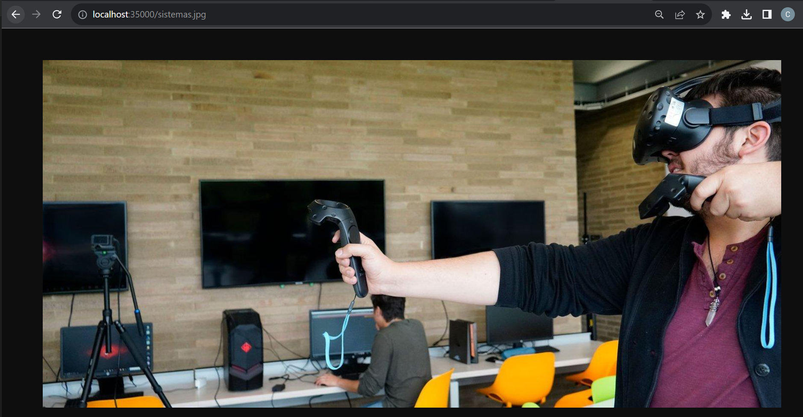

# TALLER 3: MICROFRAMEWORKS WEB

Para este ejercicio usted deb construir un  servidor web para soportar una funcionalidad similar a la de Spark. Su aplicación debe permitir por lo menos el registro de servicios get y post usando funciones lambda. Implemente igualmente funciones que le permitan configurar el directorio de los archivos estáticos, y otra que permita cambiar el tipo de la respuesta a "application/json". Para esto solo debe usar el API básico de Java. No utilice frameworks como Spark o Spring.


## Getting Started

Estas instrucciones te ayudarán a obtener una copia del proyecto en funcionamiento en tu máquina local para desarrollo y pruebas. Consulta la sección de "Despliegue" para obtener notas sobre cómo implementar el proyecto en un sistema en vivo.

### Prerequisites

Cosas que necesitas instalar y cómo hacerlo.

- [Java Development Kit (JDK)](https://www.oracle.com/java/technologies/javase-jdk11-downloads.html)
- [Maven](https://maven.apache.org/install.html)

### Installing

Sigue estos pasos para configurar tu entorno de desarrollo:

1. Clona el repositorio:

   ```bash
   https://github.com/juan-bazurto-eci/lab_arep_3
2. Navega al directorio del proyecto

    ```
   cd lab_arep_3
   ```

3. Hacemos la construccion del proyecto

   ```
   mvn package
   ```

## Deployment

Ejecutamos los siguientes comandos

    mvn clean package install
    mvn clean install

Corremos el servidor

	 mvn exec:java -"Dexec.mainClass"="org.example.HttpServer"

Accedemos a la siguiente URL

	 https://localhost:35000/

## Running the tests

El servidor responde a todas las imagenes y archivos estaticos de la carpeta public


#### Test





## Built With
* [Java](https://www.java.com/) - Lenguaje de programación principal
* [Maven](https://maven.apache.org/) - Gestión de dependencias y construcción del proyecto
* Git - Control de versiones
* HTML, JavaScript - Interfaz de usuario

## Authors

* **Juan Camilo Bazurto** - [Linkedin](https://www.linkedin.com/in/juan-camilo-b-b65379105/) - [GitHub](https://github.com/juan-bazurto-eci)